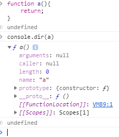
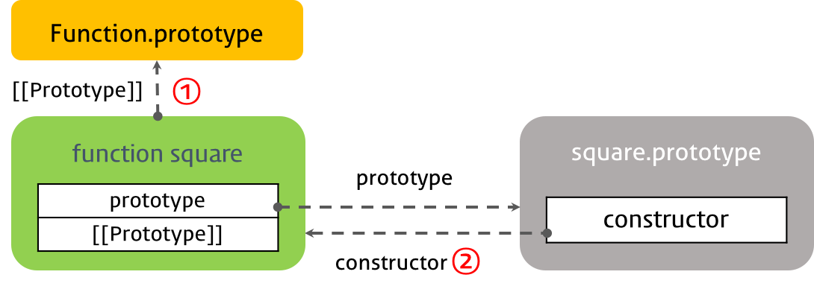

# JavaScript 6

##  함수 객체 프로퍼티
함수도 객체이므로 프로퍼티를 가질 수 있다

함수는 일반 객체와 다른 함수만의 표준 프로퍼티를 가진다
> arguments / caller / length / name / prototype


* argument
  * 함수 호출 시 전달되는 argument들의 정보를 담고 있는 순회가능한 유사 배열 객체
  * 함수 내부에서 지역변수처럼 사용된다 -> 함수 외부에서 사용 불가능
  * 이러한 argument 프로퍼티는 ES3부터 표준에서 deprecated되었다 쓰지 말자 -> ~~Function.arguments~~
  * 함수 정의에 따른 인수를 전달하지 않아도 에러가 발생하지 않는다
    * parameter는 argument로 초기화된다
    * 정의되어진 argument보다 적개 전달되었을 때, 전달되지 않은 argument는 undefined으로 초기화 된다
    * 정의되어진 argument보다 많이 전달되었을 때, 초과된 argument는 무시된다
    * argument의 수에 따라 동작을 달리 하려할 때는 함수 내부에서 arguments를 사용하면 된다
  * 함수를 호출할 때, 암묵적으로 arguments 객체가 함수 내부로 전달된다
    * 이 arguments는 유사배열이므로 배열 메소드를 사용하려면 Function.prototype.call, Function.prototype.apply를 사용해야 한다
```javascript
function sum() {
  if (!arguments.length) return 0;

  // arguments 객체를 배열로 변환
  var array = Array.prototype.slice.call(arguments);
  return array.reduce(function (pre, cur) {
    return pre + cur;
  });
}

console.log(sum());        // 0
console.log(sum(1, 2));    // 3
console.log(sum(1, 2, 3)); // 6
```

* caller
  * caller 프로퍼티는 자신을 호출한 **함수** 를 의미
```javascript
function foo(func) {
  var res = func();
  return res;
}

function bar() {
  return 'caller : ' + bar.caller;
}

console.log(foo(bar)); // function foo(func) {...}
console.log(bar());    // null (browser에서의 실행 결과)
```

* length 프로퍼티
  * 함수 정의 시 작성된 매개변수 갯수를 의미
  * arguments.length의 값과 다를 수 있다
  * arguments.length는 함수 호출시 인자의 갯수이다

* name 프로퍼티
  * 함수명이며 기명함수일 경우 함수명, 익명함수일 경우 빈문자열을 가진다

* \___proto__ 프로퍼티
  * **ECMAScript spec에서 모든 객체는 자신의 프로토타입을 가리키는 [[Prototype]]이라는 숨겨진 프로퍼티를 가진다**
  * 크롬, 파폭 등등에서 [[Prototype]]을 \___proto__라고 정의되어 있다
  * 함수의 프로토타입 객체는 Function.prototype 이며 이도 함수이다

```JavaScript
function foo() {
  return
}

console.log(foo.__proto__ === Function.prototype);              //true
console.log(Object.getPrototypeOf(foo) === Function.prototype); //true
```

* prototype 프로퍼티
  * 함수만 가지고 있는 프로퍼티이며 자바스크립트 객체지향의 근간이다
  * 이 'prototype'은 '\___proto__'와 다르다
  * 두가지 모두 프로토타입 객체를 가리키지만 다른 관점이 있다
  * [[Prototype]]
    * 모든 객체가 가지고 있는 프로퍼티
    * 객체의 입장에서 자신의 부모 역할을 하는 프로토타입 객체를 가리키며 함수 객체의 경우 Function.prototype을 가리킨다
  * prototype
    * 함수 객체만 가지고 있는 프로퍼티
    * 함수 객체가 생성자로 사용될 때 이 함수를 통해 생성된 객체의 부모 역할을 하는 객체를 가리킨다
    * 함수가 생성될 때 만들어 지며 constructor 프로퍼티를 가지는 객체를 가리킨다
    * constructor 프로퍼티는 함수 객체 자신을 가리킨다

[](https://poiemaweb.com/js-function#66-prototype-%ED%94%84%EB%A1%9C%ED%8D%BC%ED%8B%B0)

##  다양한 함수 형태
* Immediately Invoke Function Expression, 즉시 실행 함수
  * 최초 한번만 호출되며 다시 호출할 수 없다
  * 최초 한번만 실행이 필요한 초기화 처리등을 사용할 수 있다
  * 자바스크립트는 파일이 분리되어 있어도 글로벌 스코프가 하나이며 글로벌 스코프에 선언된 변수나 함수는 코드 내의 어디서든 접근이 가능하다
  * 스크립트 파일 내에서 동일한 이름의 변수나 함수가 같은 스코프 내에 존재할 경우 원하지 않는 결과가 발생할 수 있다
  * 즉시 실행 함수 내에 처리 로직을 모아둔다면 변수, 함수명의 충돌을 방지할 수 있다

```JavaScript
// 기명 즉시 실행 함수(named immediately-invoked function expression)
(function myFunction() {
  var a = 3;
  var b = 5;
  return a * b;
}());

// 익명 즉시 실행 함수(immediately-invoked function expression)
(function () {
  var a = 3;
  var b = 5;
  return a * b;
}());

//foo의 충돌 방지를 위해 즉시 실행 함수로 초기화 하는 예시
(function () {
  var foo = 1;
  console.log(foo);
}());

var foo = 100;
console.log(foo);
```

* Inner function, 내부 함수
  * 함수 내부에 정의된 함수를 내부함수라 한다
  * 내부 함수에 정의된 함수는 부모 함수의 변수에 접근할 수 있지만, 부모는 내부함수의 변수에 접근할 수 없다
  * 추가적으로 내부 함수는 부모함수 외부에서 접근할 수 없다

```JavaScript
function parent(param) {
  var parentVar = param;
  var child = function() {
    var childVar = 'lee';
    console.log(parentVar + ' ' + childVar); // Hello lee
  }
  child();
  console.log(parentVar + ' ' + childVar);
  // Uncaught ReferenceError: childVar is not defined
}
parent('Hello');
child();  //child() is not defined
```

* Callback function, 콜백 함수
  * 콜백 함수란, 함수를 명시적으로 호출하는 방식이 아닌 특정 이벤트가 발생했을 때 시스템에 의해 호출되는 함수
  * 대표적으로 이벤트 핸들러 처리가 있다
  * 자바스크립트의 함수는 변수처럼 사용할 수 있으며, 콜백 함수는 매개변수를 통해 전달되고 전달받은 함수의 내부에서 어느 특정시점에 실행되어진다
  * 콜백 함수는 주로 비동기식 처리 모델에 사용된다
    * 처리가 끝이 나면 호출될 콜백함수를 미리 매개변수에 전달하고 처리가 종료되면 콜백함수를 호출한다
  * 콜백 함수는 콜백 큐에 있다가 해당 이벤트가 발생시 호출된다
  * 콜백 함수는 클로저이므로 콜백 큐에 단독으로 존재하다가 호출되어도 콜백함수를 전달받은 함수의 변수에 접근할 수 있다

```JavaScript
function doSomething() {
  var name = 'Lee';

  setTimeout(function () {
    console.log('My name is ' + name);
  }, 100);
}

doSomething(); // My name is Lee
//doSomething안에 setTimeout의 parameter로 들어가 있는 function(){~~~} <- 이부분이 콜백 함수
//0.1초 뒤에 콜백 함수가 동작하며 로그가 찍힌다
```
